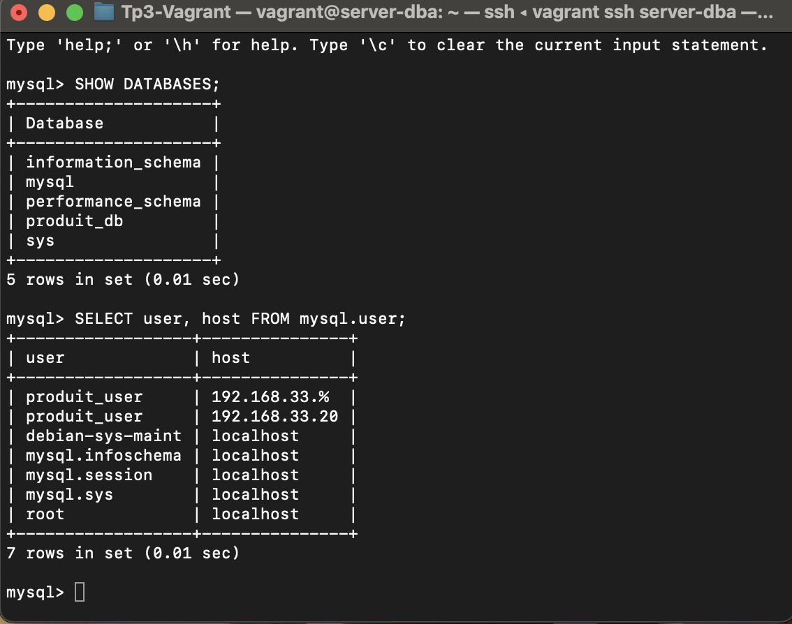
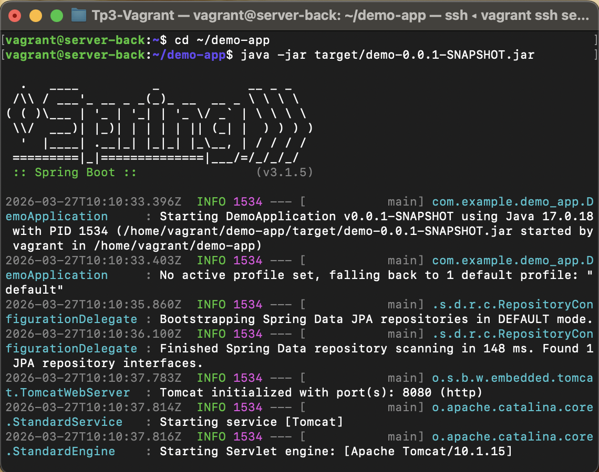
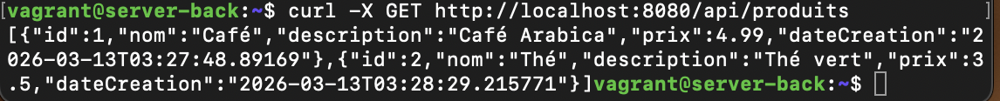
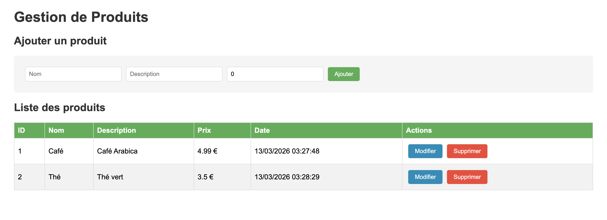
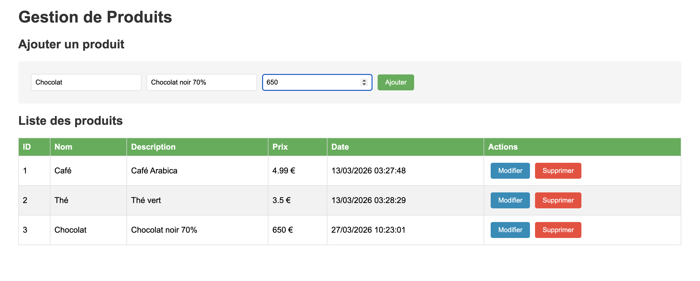
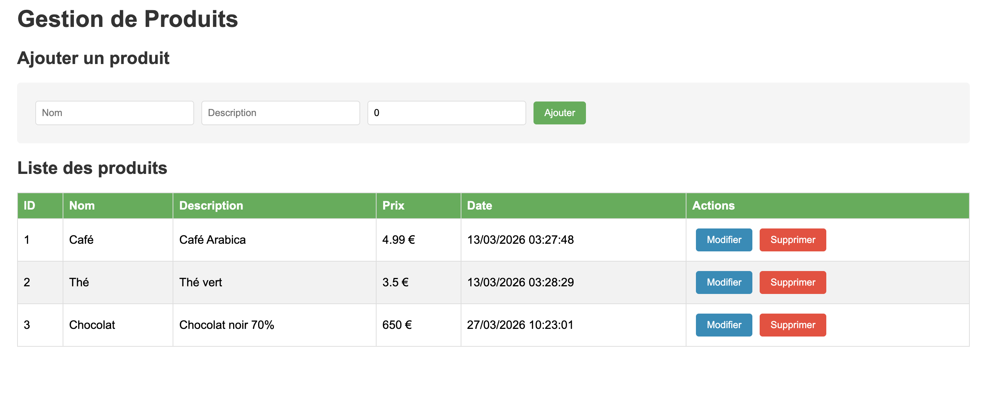
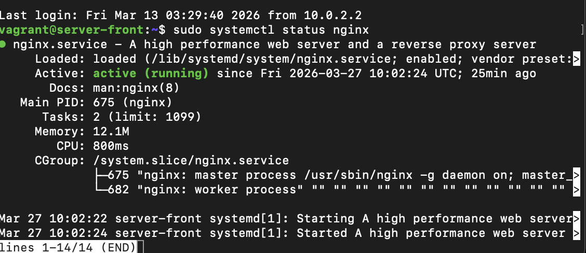
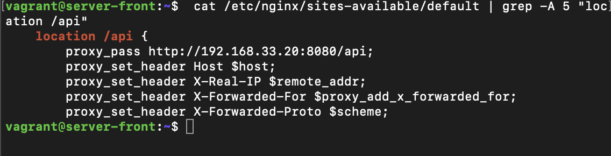

# TP3-Vagrant

## Objectif du TP

Créer une architecture **3 tiers** avec Vagrant composée de :

| **server-back** : Backend Spring Boot (JDK 17) | 192.168.33.20 | 8080 |
| **server-dba**  : Base de données MySQL | 192.168.33.21 | 3306 |
| **server-front** : Frontend Angular avec Nginx | 192.168.33.22 | 80

L'application permet de gérer des produits (CRUD complet) avec une interface Angular communiquant avec une API REST Spring Boot, elle-même connectée à MySQL.

## Partie 1 : Création des VM avec Vagrant

### Lancement des machines
La commande : vagrant up ( positionnez vous au niveau dossier qui contient le readme)


## Partie 2 : Configuration de la base de données (server-dba)

### Connexion au serveur dba
vagrant ssh server-dba

### Création de la base et de l'utilisateur

```sql
CREATE DATABASE produit_db;
CREATE USER 'produit_user'@'192.168.33.20' IDENTIFIED BY 'password';
GRANT ALL PRIVILEGES ON produit_db.* TO 'produit_user'@'192.168.33.20';
```


## Partie 3 : Backend Spring Boot

### Connexion au serveur backend
vagrant ssh server-back
cd ~/demo-app
java -jar target/demo-0.0.1-SNAPSHOT.jar


### Test de l'API REST

```bash
curl -X GET http://localhost:8080/api/produits
```


## Partie 4 : Frontend Angular

### Interface utilisateur

L'application Angular affiche la liste des produits récupérés depuis l'API Spring Boot.




### Ajout d'un produit

#### Formulaire d'ajout
Formulaire d'ajout rempli()


#### Liste après ajout



## Partie 5 : Frontend Angular avec Nginx

### Installation et configuration de Nginx

```bash
sudo systemctl status nginx
```


 